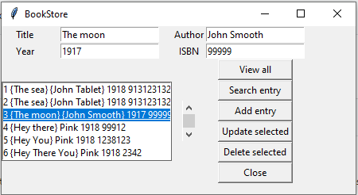

# BookStore

Bookstore desktop application us built using tkinter library.It helps to add new books to bookstore,edit,view and delete them.They can be searched using title,year,author or ISBN.
  
  
  To run this code
  
  ## python frontend.py
  
  
# View output of this project
  
  
  
